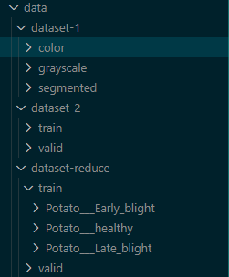

# Configuracion de los dataset:

## Estructura

> dataset-1: Carpeta renombrada con la información de [PlantVillage Dataset](https://www.kaggle.com/abdallahalidev/plantvillage-dataset)

> dataset-2: Carpeta renombrada con la información de [New Plant Diseases Dataset](https://www.kaggle.com/vipoooool/new-plant-diseases-dataset)

> dataset-reduce: Contiene informacion de la planta Potato del dataset-2
